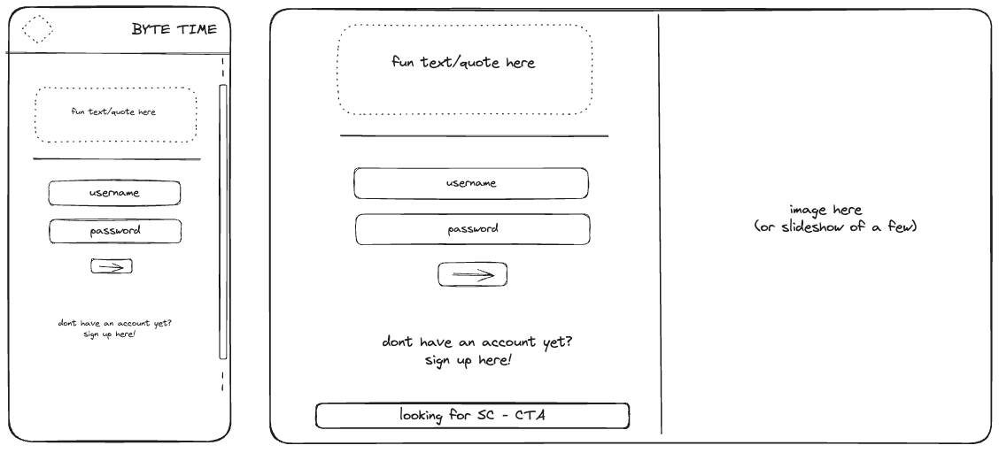

# Byte Time Front End

Front end repo for Byte Time, a final group project for the 2023/24 She Codes Plus program.

           

[](https://opensource.org/licenses/MIT)

---

[About](#about) ✦ [Wireframes](#wireframes) ✦ [Future Developments](#future-developments) ✦ [Resources](#resources) ✦ [License](#license) ✦ [Contact](#contact)

---

## About

https://bytetime.netlify.app/

### What is Byte Time?

Byte Time is an app that facilitates the onboarding and management process of assigning users to an event based on availability and skill set.

### Why Byte Time?

Created as part of the 2023/24 She Codes Plus Cohort. The team consisted of: Charlotte Durber, Cathy O'Halloran, Shannon Oliver, Jignasa Patel, Bex Logan and Caoimhe Young.

For this project, we were asked to create an internal platform to schedule mentors for the She Codes Company.

This repo is for the front end of the app. If you are interested in the back end, please visit https://github.com/SheCodesAus/2024_bit_by_bit_back_end

### Intended Audience/User Stories

```md
AS AN Admin
I WANT to onboard a mentor
SO THAT I can match the mentor with an event.
```

```md
AS A Mentor
I WANT to create a mentor profile
SO THAT I can be mentor at She Codes events
```

```md
AS AN admin
I WANT to organise an event with appropriate staffing
SO THAT events can run smoothly.
```

## Wireframes

### Global Pages




### Admin Pages/views


### Mentor Pages/views


## Demo Images

## Future Developments

## Resources

## License

This project is using the following license:

**MIT**

For further information regarding the license, please follow the link below:
https://opensource.org/licenses/MIT

---

## Contact

If you have any further questions, please contact via email or github.

| Name             | Role                               | Email                                                                                                                                                                  | Github                                                                                                                                                                                                | LinkedIn                                                                                                                                                                             |
| ---------------- | ---------------------------------- | ---------------------------------------------------------------------------------------------------------------------------------------------------------------------- | ----------------------------------------------------------------------------------------------------------------------------------------------------------------------------------------------------- | ------------------------------------------------------------------------------------------------------------------------------------------------------------------------------------ |
| Charlotte Durber | Project Manager                    | <a href="cdurber@gmail.com">            | <a href="https://github.com/cdurber90"></a>     | <a href="https://www.linkedin.com/in/charlottedurber/">            |
| Cathy O'Halloran | Backend Lead                       | <a href="cathy.o'halloran@rwwa.com.au"> | <a href="https://github.com/COHally/"></a>      | <a href="https://www.linkedin.com/in/cathy-o-halloran-60687b288/"> |
| Shannon Oliver   | Frontend Designer                  | <a href="shannon-alexis@hotmail.com">   | <a href="https://github.com/shannon97"></a>     | <a href="https://www.linkedin.com/in/shannon-a-oliver/">           |
| Jignasa Patel    | Database Designer                  | <a href="jigudhari_23@yahoo.com">       | <a href="https://github.com/Jigudhari"></a>     | <a href="https://www.linkedin.com/in/jignasa23/">                  |
| Bex Logan        | Git Manager                        | <a href="bek.jayne@gmail.com">          | <a href="https://github.com/BBLogan"></a>       | <a href="https://www.linkedin.com/in/bexlogan/">                   |
| Caoimhe Young    | Front End engineer and Git Manager | <a href="caoimhejyoti@gmail.com">       | <a href="https://github.com/caoimhejyoti/"></a> | <a href="https://www.linkedin.com/in/caoimhe-young/">              |
